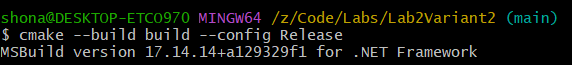

## 🚀 Performance Results

### With Maximum Optimization (`-O3`)

```txt
---   Max Optimization  ---
--- Data size: 100000000 ---

Custom parallel algorithm:
K = 1, Time = 29 ms
K = 2, Time = 17 ms
K = 3, Time = 16 ms
K = 4, Time = 14 ms
K = 5, Time = 14 ms
K = 6, Time = 13 ms
K = 7, Time = 16 ms
K = 8, Time = 14 ms
K = 10, Time = 14 ms
K = 12, Time = 14 ms

Best K: 6
Hardware threads: 6

--- Data size: 300000000 ---

Custom parallel algorithm:
K = 1, Time = 89 ms
K = 2, Time = 52 ms
K = 3, Time = 47 ms
K = 4, Time = 45 ms
K = 5, Time = 42 ms
K = 6, Time = 42 ms
K = 7, Time = 50 ms
K = 8, Time = 47 ms
K = 10, Time = 41 ms
K = 12, Time = 41 ms

Best K: 10
Hardware threads: 6

--- Data size: 500000000 ---

Custom parallel algorithm:
K = 1, Time = 150 ms
K = 2, Time = 83 ms
K = 3, Time = 74 ms
K = 4, Time = 70 ms
K = 5, Time = 70 ms
K = 6, Time = 68 ms
K = 7, Time = 71 ms
K = 8, Time = 69 ms
K = 10, Time = 68 ms
K = 12, Time = 67 ms

Best K: 12
Hardware threads: 6
```

### Without Optimization (`-O0`)

```txt
---   No Optimization   ---
--- Data size: 100000000 ---

Custom parallel algorithm:
K = 1, Time = 29 ms
K = 2, Time = 16 ms
K = 3, Time = 15 ms
K = 4, Time = 14 ms
K = 5, Time = 14 ms
K = 6, Time = 14 ms
K = 7, Time = 16 ms
K = 8, Time = 15 ms
K = 10, Time = 14 ms
K = 12, Time = 13 ms

Best K: 12
Hardware threads: 6

--- Data size: 300000000 ---

Custom parallel algorithm:
K = 1, Time = 91 ms
K = 2, Time = 51 ms
K = 3, Time = 45 ms
K = 4, Time = 45 ms
K = 5, Time = 42 ms
K = 6, Time = 42 ms
K = 7, Time = 48 ms
K = 8, Time = 44 ms
K = 10, Time = 42 ms
K = 12, Time = 42 ms

Best K: 5
Hardware threads: 6

--- Data size: 500000000 ---

Custom parallel algorithm:
K = 1, Time = 148 ms
K = 2, Time = 82 ms
K = 3, Time = 75 ms
K = 4, Time = 71 ms
K = 5, Time = 73 ms
K = 6, Time = 74 ms
K = 7, Time = 71 ms
K = 8, Time = 71 ms
K = 10, Time = 71 ms
K = 12, Time = 70 ms

Best K: 12
Hardware threads: 6
```


